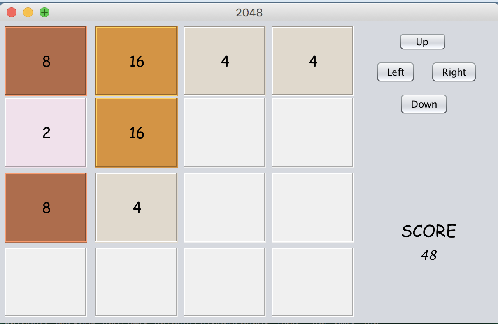

# 2048
This 2048 game has been developed from the inspiration of famous game [2048](https://play2048.co/). The main language of the game is Java. During the development of the game I got to learn about many things design patterns like `Singleton Instance` and Java GUI libraries like `java applet` and `java swing`. 

**This game is compatible with Java 7 or above.**

### Screenshots


### How to start
```
cd 2048
java -jar 2048.jar
```

### Controls
- Mouse
- Arrow Keys
- 'W' 'A' 'S' 'D' keys


### Next Target
Develop the game by using a dynamic N*N matrix and introducing AI to play the game.
